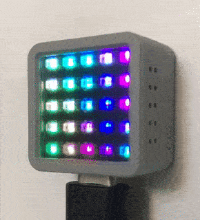

# Atom Waves

Displays a 2D traveling sine wave in each color channel of the 5x5 LED display of an [M5 ATOM ESP32 microcontroller](https://m5stack.com/collections/m5-atom).

Each wave moves independently and has independent parameters for wavelength and velocity.

Wave velocities are also continuously rotated over time, adding to a more chaotic yet fluid movement.

# Building and Running

To get up-and-running for M5Atom on Arduino:
- Set board to "ESP32 Pico Kit"
- Install "M5Atom" and "FastLED" libraries
- Select serial port connected to your board
- Set upload speed to 115200

Platform.io users:
- Install "M5Atom" and "FaseLED" libraries
- Choose "build and upload" from the tasks (all configuration is already be set in platformio.ini)
